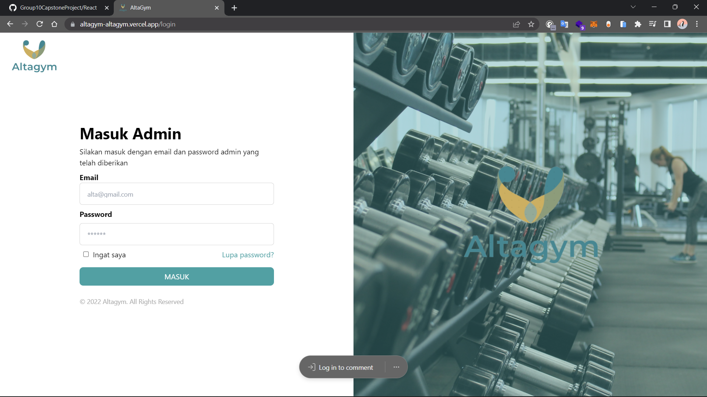
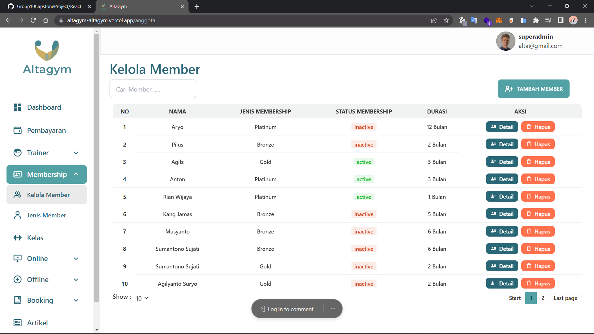

# GYM MEMBERSHIP

## Nama Aplikasi

`AltaGym`

## Deskripsi

Altagym merupakan perusahaan yang bergerak dibidang olahraga. Altagym memiliki platfotm yang menyediakan berbagai kelas olahraga berkualitas untuk dilakukan di rumah maupun di tempat gym dengan pendampingan pelatih proffesional dibidangnya.

## GOALS

Tujuan dari project ini adalah untuk memfasilitasi masyarakat di tengah pandemi untuk tetap sehat dengan mengikuti kelas fitness online & offline dan memberikan fasilitas keanggotaan yang diadakan oleh Altagym.

## MVP SUCCESS

1. Landing Page
2. Manage membership
3. Manage offline classes
4. Manage offline classes booking
5. Manage online classes
6. Manage online classes booking

## Fitur Nilai Plus

1. Manage admins
2. Manage newsletters

## Fitur Tambahan dari role Backend

- Trainers

## Tools

1. REACT JS
2. VISUAL STUDIO CODE
3. GITHUB
4. NODE JS
5. TAILWIND CSS
6. VERCEL
7. POSTMAN

## PACKAGES/LIBRARIES USED

- arismun/format-rupiah
- aos
- axios
- boxicons
- daisyui
- js-cookie
- moment
- react-helmet
- react-hot-toast
- react-moment
- react-router-dom
- react-scroll
- react-select

## UI AltaGym

1. LOGIN
   

2. LANDING PAGE
   

3. MANAGE MEMBERSHIP
   

   

4. MANAGE OFFLINE CLASSES
   

   

5. MANAGE OFFLINE CLASSES BOOKING
   

6. MANAGE ONLINE CLASSES
   

   

7. MANAGE ONLINE CLASSES BOOKING
   

## Domain Site

https://altagym-altagym.vercel.app/login
